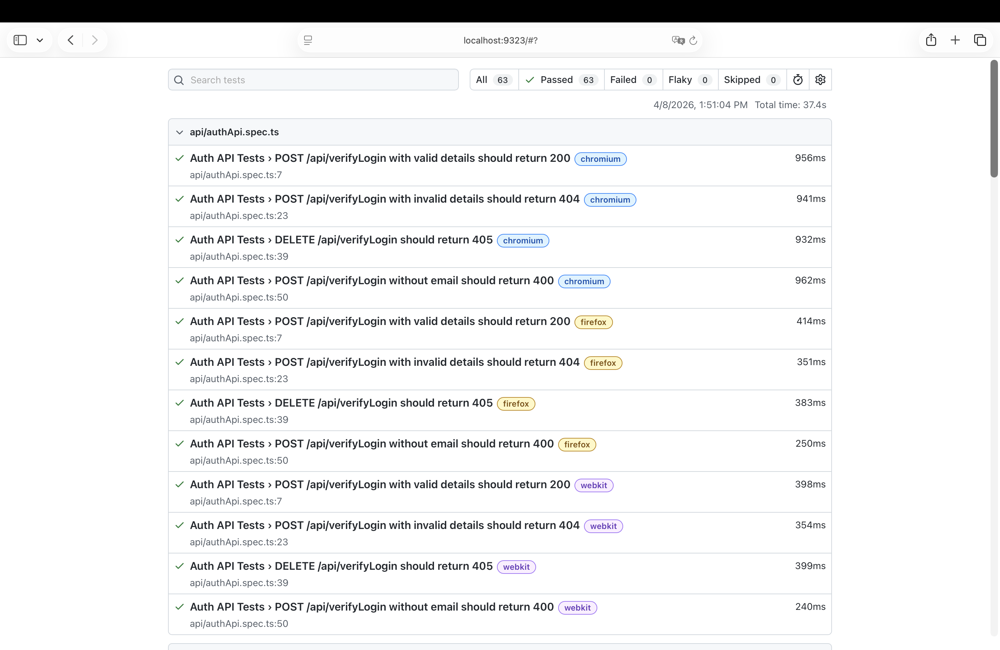
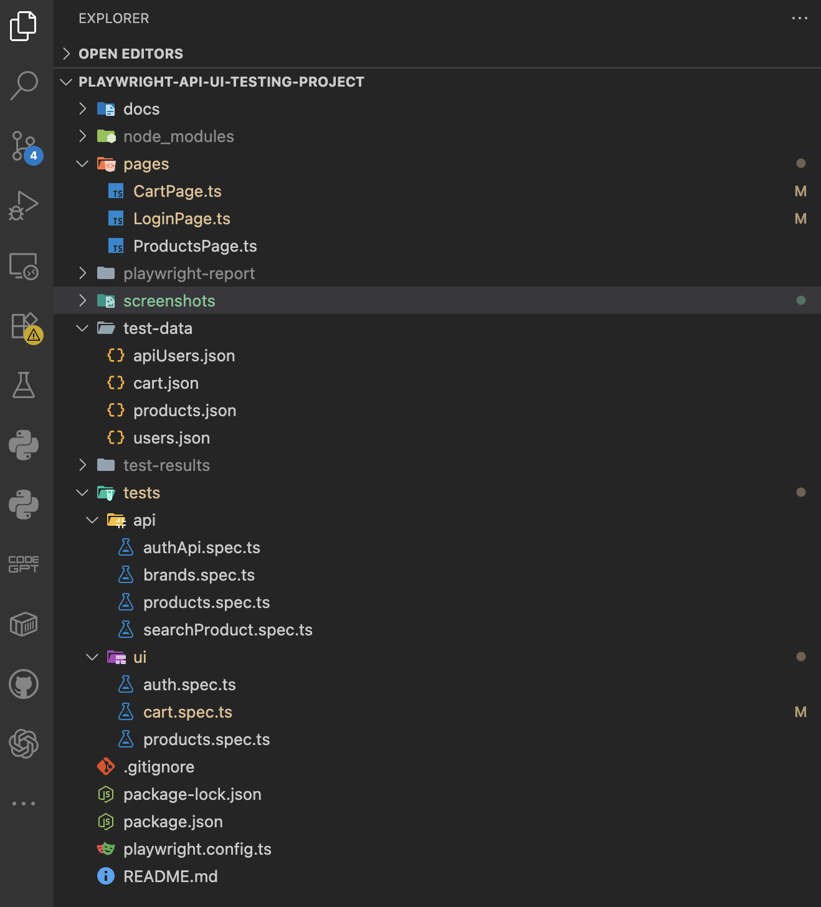
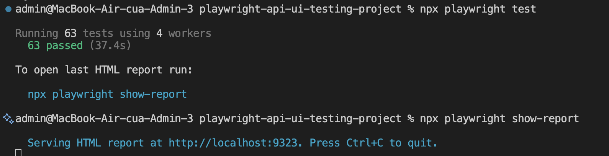

# Automation Exercise QA Project

## Project Overview

This is a QA automation portfolio project for testing the website https://automationexercise.com/.

The project demonstrates:

* Manual testing documentation
* UI automation testing using Playwright
* API testing using Playwright
* Structured test project suitable for QA fresher/intern roles

---

## Scope

The testing scope includes:

* Authentication (Login/Logout)
* Products
* Search functionality
* Cart functionality
* API endpoints

---

## Tech Stack

* Playwright
* TypeScript
* Node.js
* Visual Studio Code
* GitHub

---

## Folder Structure

automationexercise-qa-project/
├── screenshots/
│   ├── html-report.png
│   ├── folder-structure.png
│   └── test-run-pass.png
├── tests/
│   ├── ui/
│   │   ├── auth.spec.ts
│   │   ├── cart.spec.ts
│   │   └── products.spec.ts
│   └── api/
│       ├── authApi.spec.ts
│       ├── brands.spec.ts
│       ├── products.spec.ts
│       └── searchProduct.spec.ts
├── pages/
│   ├── LoginPage.ts
│   ├── ProductsPage.ts
│   └── CartPage.ts
├── test-data/
│   ├── users.json
│   ├── products.json
│   ├── cart.json
│   └── apiUsers.json
├── docs/
│   ├── test-plan.md
│   ├── test-cases.md
│   └── bug-report.md
├── playwright.config.ts
├── package.json
├── tsconfig.json
└── README.md

---

## Test Scenarios Covered

### UI Automation

* Login with valid credentials
* Login with invalid credentials
* Logout user
* Search existing product
* Search non-existing product
* Add product to cart
* Verify product in cart
* Remove product from cart

### API Testing

* GET all products list → 200
* POST products list → 405
* GET all brands list → 200
* PUT brands list → 405
* POST search product with valid data → 200
* POST search product without parameter → 400
* POST verify login with valid credentials → 200
* POST verify login with invalid credentials → 404

---

## How to Run

Install dependencies:

npm install

Install Playwright browsers:

npx playwright install

Run all tests:

npx playwright test

Open HTML report:

npx playwright show-report

Run UI tests only:

npx playwright test tests/ui

Run API tests only:

npx playwright test tests/api

---

## Sample Report Screenshot

### HTML Report

### Project Structure

### Test Execution Result

---

## Author

Hoang Nhu Hau 
QA Automation Intern / Fresher Portfolio Project